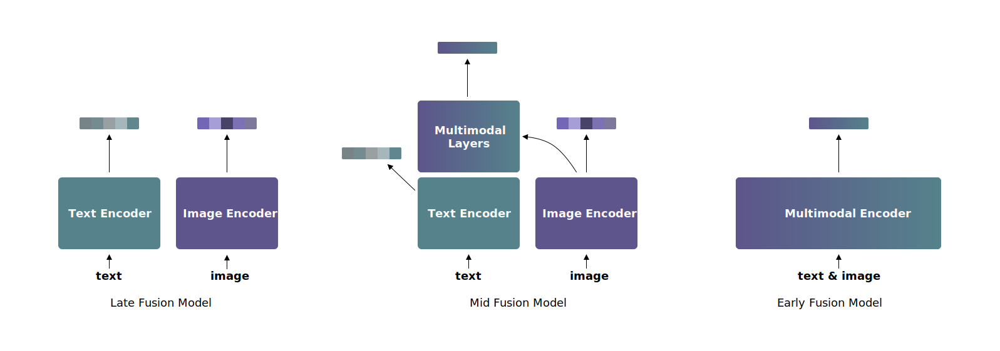

<h1 align="center">UForm</h1>
<h3 align="center">
Multi-Modal Inference Library<br/>
For Semantic Search Applications<br/>
</h3>
<br/>

<p align="center">
<a href="https://discord.gg/jsMURnSFM2"></a>
&nbsp;&nbsp;&nbsp;
<a href="https://www.linkedin.com/company/unum-cloud/"></a>
&nbsp;&nbsp;&nbsp;
<a href="https://twitter.com/unum_cloud"></a>
&nbsp;&nbsp;&nbsp;
<a href="https://unum.cloud/post"></a>
&nbsp;&nbsp;&nbsp;
<a href="https://github.com/unum-cloud/uform"></a>
</p>

---

UForm is Multi-Modal Modal Inference package, designed to encode Multi-Lingual Texts, Images, and, soon, Audio, Video, and Documents, into a shared vector space!

It extends HuggingFace `transfromers` to mid fusion model. Three types of multimodal models exist:

\


\
__Late fusion models__ encode each modality independently, but into one shared vector space. Due to independent encoding late fusion models are good at capturing coarse-grained features but often neglect fine-grained ones. This type of models is well-suited for retrieval in large collections. The most famous example of such models is CLIP by OpenAI.

__Early fusion models__ encode both modalities jointly so they can take into account fine-grained features. Usually, these models are used for re-ranking relatively small retrieval results.

__Mid fusion models__ are golden middle between the previous two types. Mid fusion models consist of two parts – unimodal and multimodal. The unimodal part allows encoding each modality separately as late fusion models do. The multimodal part takes unimodal features from the unimodal part as input and enhances them by cross-attention mechanism.
Mid fusion models combine the speed of late fusion models and the accuracy of early fusion models.

HuggingFace `transfromers` library has not supported mid fusion models' architecture yet, and because of it we wrote a small wrapper for it.

## Installation

```bash
pip install uform
```

## Usage

To load model use following code:

```python
import uform

model = uform.get_model('english') # for the monolingual model
model = uform.get_model('multilingual') # for the multilingual model
```

To encode data:

```python
from PIL import Image

# data preprocessing
image = Image.open('red_panda.jpg')
image_data = model.preprocess_image(image).unsqueeze(0)
text = 'a small red panda in a zoo'
# text_data contains the tokenized text and the attention mask
text_data = model.preprocess_text(text)

image_embedding = model.encode_image(image_data)
text_embedding = model.encode_text(text_data)
image_text_embedding = model.encode_multimodal(image=image_data, text=text_data)
```

You can get not only embeddings but features too:

```python
image_features, image_embedding = model.encode_image(image_data, return_features=True)
text_features, text_embedding = model.encode_text(text_data, return_features=True)
```

These features also can be used for multimodal encoding:

```python
image_text_embedding = model.encode_multimodal(
    image_features=image_features,
    text_features=text_features,
    attention_mask=text_data['attention_mask']
)
```

`model.encode_multimodal(image=image, text_data=text_data)` calls `encode_image` and `encode_text` under the hood. So if you already have text and image features, `model.encode_multimodal` call with features is faster and preferable.

\
There are two options to calculate semantic compatibility between an image and a text:

\
1\. __Cosine similarity__ between unimodal embeddings:

```python
# vectors normalization
image_embedding /= image_embedding.square().sum(dim=1, keepdim=True).pow(0.5)
text_embedding /= text_embedding.square().sum(dim=1, keepdim=True).pow(0.5)

cos_sim = (image_embedding * text_embedding).sum(dim=1)
```

or using PyTorch:

```python
import torch.nn.functional as F

cos_sim = F.cosine_similarity(image_embedding, text_embedding)
```

Cosine similarity is in range from -1 to 1, where -1 means that the image and the text have nothing in common and 1 is absolute semantic match.

__Pros__:

* Cosine similarity is essentialy matrix multiplication, so it can be performed extemely fast on modern hardware.
* Only unimodal embeddings are required, unimodal encoding is faster than joint encoding.
* Suitable for retrieval in large collections.

__Cons__:

* Takes into account only coarse-grained features.

\
2. __Matching score__ (using joint embedding):

```python
score = model.get_matching_scores(image_text_embedding)
```

Matching score equals to the the probability (so it is in range from 0 to 1) that the image and the text contain the same semantics.

__Pros__:

* Joint embedding captures fine-grained features
* Suitable for re-ranking: you can improve unimodal retrieval result by reordering items based on matching scores

__Cons__:

* Resource-intensive
* Not suitable for retrieval in large collections


## Models

The Multilingual model supports 11 language, trained on a balanced dataset, containing the following languages.

|      |      |      |      |
| :--- | :--- | :--- | :--- |
| en   | de   | es   | fr   |
| it   | jp   | ko   | pl   |
| ru   | tr   | zh   |      |

### Architecture

| Model        | Language Tower | Image Tower |  Multimodal size  |  URL |
| :----------- | :------------: | :---------: | :------: | ---: |
| English  | BERT, 2 layers |  ViT-B/16   | 2 layers |      |
| Multilingual | BERT, 8 layers |  ViT-B/16   | 4 layers |      |

### Performance