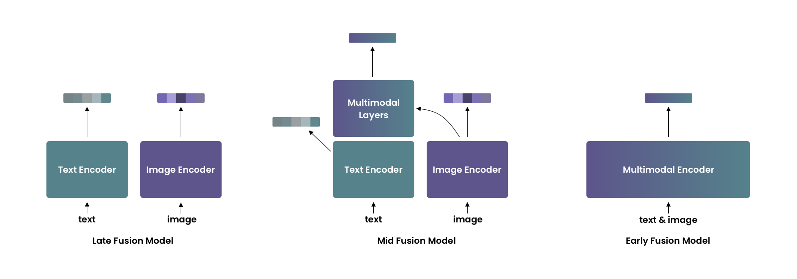

<h1 align="center">UForm</h1>
<h3 align="center">
Multi-Modal Inference Library<br/>
For Semantic Search Applications<br/>
</h3>
<br/>

<p align="center">
<a href="https://discord.gg/jsMURnSFM2"></a>
&nbsp;&nbsp;&nbsp;
<a href="https://www.linkedin.com/company/unum-cloud/"></a>
&nbsp;&nbsp;&nbsp;
<a href="https://twitter.com/unum_cloud"></a>
&nbsp;&nbsp;&nbsp;
<a href="https://unum.cloud/post"></a>
&nbsp;&nbsp;&nbsp;
<a href="https://github.com/unum-cloud/uform"></a>
</p>

---

UForm is a Multi-Modal Modal Inference package, designed to encode Multi-Lingual Texts, Images, and, soon, Audio, Video, and Documents, into a shared vector space!
It comes with a set of homonymous pre-trained networks available on [HuggingFace portal](https://huggingface.co/unum-cloud/uform) and extends the `transfromers` package to support Mid-fusion Models.

## Three Kinds of Multi-Modal Encoding



__Late-fusion models__ encode each modality independently, but into one shared vector space.
Due to independent encoding late-fusion models are good at capturing coarse-grained features but often neglect fine-grained ones.
This type of models is well-suited for retrieval in large collections.
The most famous example of such models is CLIP by OpenAI.

__Early-fusion models__ encode both modalities jointly so they can take into account fine-grained features.
Usually, these models are used for re-ranking relatively small retrieval results.

__Mid-fusion models__ are the golden midpoint between the previous two types.
Mid-fusion models consist of two parts – unimodal and multimodal.
The unimodal part allows encoding each modality separately as late-fusion models do.
The multimodal part takes unimodal features from the unimodal part as input and enhances them with a cross-attention mechanism.

This tiny package will help you deal with the last!

## Installation

```bash
pip install uform
```

## Usage

To load the model:

```python
import uform

model = uform.get_model('english')
model = uform.get_model('multilingual')
```

To encode data:

```python
from PIL import Image

text = 'a small red panda in a zoo'
image = Image.open('red_panda.jpg')

image_data = model.preprocess_image(image).unsqueeze(0)
text_data = model.preprocess_text(text)

image_embedding = model.encode_image(image_data)
text_embedding = model.encode_text(text_data)
joint_embedding = model.encode_multimodal(image=image_data, text=text_data)
```

Retrieving features is also trivial:

```python
image_features, image_embedding = model.encode_image(image_data, return_features=True)
text_features, text_embedding = model.encode_text(text_data, return_features=True)
```

These features can later be used to produce joint multimodal encodings faster, as the first layers of the transformer can be skipped:

```python
joint_embedding = model.encode_multimodal(
    image_features=image_features,
    text_features=text_features,
    attention_mask=text_data['attention_mask']
)
```

## Evaluation

There are two options to calculate semantic compatibility between an image and a text: [Cosine Similarity](#cosine-similarity) and [Matching Score](#matching-score).

### Cosine Similarity

```python
import torch.nn.functional as F

similarity = F.cosine_similarity(image_embedding, text_embedding)
```

The `similarity` will belong to the `[-1, 1]` range, `1` meaning the absolute match.

__Pros__:

- Computationally cheap.
- Only unimodal embeddings are required, unimodal encoding is faster than joint encoding.
- Suitable for retrieval in large collections.

__Cons__:

- Takes into account only coarse-grained features.


### Matching Score 

Unlike cosine similarity, unimodal embedding are not enough.
Joint embedding will be needed and the resulting `score` will belong to the `[0, 1]` range, `1` meaning the absolute match.

```python
score = model.get_matching_scores(joint_embedding)
```

__Pros__:

- Joint embedding captures fine-grained features.
- Suitable for re-ranking - sorting retrieval result.

__Cons__:

- Resource-intensive.
- Not suitable for retrieval in large collections.

## Models

### Architecture

| Model        | Language Tower | Image Tower | Multimodal Part |                     URL |
| :----------- | :------------: | :---------: | :-------------: | ----------------------: |
| English      | BERT, 2 layers |  ViT-B/16   |    2 layers     | [weights.pt][weights-e] |
| Multilingual | BERT, 8 layers |  ViT-B/16   |    4 layers     | [weights.pt][weights-m] |

The Multilingual model supports 11 languages, after being trained on a balanced dataset.

|      |      |      |      |
| :--- | :--- | :--- | :--- |
| en   | de   | es   | fr   |
| it   | jp   | ko   | pl   |
| ru   | tr   | zh   |      |

[weights-e]: https://huggingface.co/unum-cloud/uform/resolve/main/english/weight.pt
[weights-m]: https://huggingface.co/unum-cloud/uform/resolve/main/multilingual/weight.pt

### Performance

On RTX 3090, the following performance is expected from `uform` on text encoding.

| Model                     | Multilingual | Sequences per Second |    Speedup |
| :------------------------ | -----------: | -------------------: | ---------: |
| `bert-base-uncased`       |           No |                1'612 |            |
| `distilbert-base-uncased` |           No |                3'174 |     x 1.96 |
| `MiniLM-L12`              |          Yes |                3'604 |     x 2.24 |
| `MiniLM-L6`               |           No |                6'107 |     x 3.79 |
|                           |              |                      |            |
| `uform`                   |          Yes |                6'809 | __x 4.22__ |
